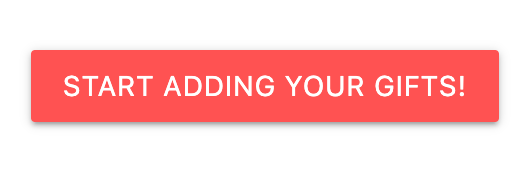
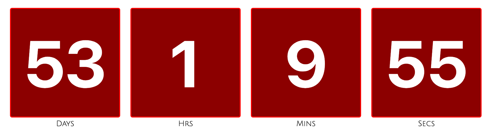
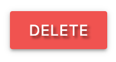

# ALL I WANT FOR CHRISTMAS

Welcome to All I Want For Christmas - the app that allows you to keep a record of all the gifts that you need to get during the busy holiday season and 'tick them off' once they have been bought.

Quite often whilst shopping or searching the internet, people see some items and think 'Ooh, that would be a great gift for Grandma, or if at the shops and you can't pick up a gift due to the gift recipients being present, then keeping an up-to-date list is one way of ensuring nothing is left in the shops - no mad dash on Christmas Eve to make sure that everyone's wish list has been met!

This app would be useful for anyone buying gifts during Christmas time - most people will be trying to keep a record of gifts ideas, and gits bought in the run up to Christmas Day. Searches can be made to see who the gifts are for, how much they cost, what items are being bought and where to buy them. It means that the gift list can be filtered to show all items needed at a particular shop without having to scroll through all the items.

Users will also be able to delete gifts if they no longer need to buy them, gifts can be edited if thiings such as prices or where to buy changes.

Here's the link to the deployed site: <https://all-i-want-for-christmas-11c6c44413ce.herokuapp.com/>


## UX

The ideas for designing the app was that it was a simple, and quick way to be able to record the gift ideas without over complicating the process. Often when seeing a good idea of a gift, people will think - I must remember this, but then when it comes to birthdays and christmas, they've forgotten what to get. Also, most people when shopping can be in a rush or busy, therefore finding a way of noting these gifts in a simple, and quick manner was paramount.

Another main feature for the app is that once the gifts have been added, they can be filtered by recipient, gift item or where to buy. This will be especially useful when rushing around the shops at Christmas - for example is someone were to find themselves in a shop like John Lewis - a quick search for 'John Lewis' will bring up all the gifts that need to be bought from thet specific shop, thus saving valuable time,

### Colour Scheme

With it being a christmas themed app, traditional colours of green and red were chosen for the main theme of the app along with christms themed imges such as Santa and Christmas lights.

- `#7cb342` used for the nav bar on all pages
- `#078021` used for primary title page text
- `#000080` used for title pages
- `#000000` used for list text

### Typography

Font Awesome was used extensively for the icons on the forms, on buttons and for the holly on the main welcome page.

Google fonts was used for various fonts throughout the app.

- [Delicious Handrawn](https://fonts.google.com/specimen/Delicious+Handrawn) was used for the brand logo - white font was chosen to make it look like snow.

- [Amatic SC](https://fonts.google.com/specimen/Amatic+SC) was used for the main welcome page text as it is a nice clean font.

- [League Script](https://fonts.google.com/specimen/League+Script) was used for the titles of most pages. This was chosen to make it look like it was hand-written in pen, just as someone would do when writing lists.

- [Grandstander](https://fonts.google.com/specimen/grandstander) was used for the flash messagesand the footer due to is clear and clean appearance.

- [Font Awesome](https://fontawesome.com) icons were used throughout the site, such as form field icons.

## User Stories

### New Site Users

- As a new site user, I would like to register as a new user, so that I can begin using the christmas gift app.
- As a new site user, I would like to start adding gifts to my list by gift name, recipient, cost and where to buy, so that I can keep a record of what I need to buy.
- As a new site user, I would like to see all the gifts I have added to my list, so that I can see what gift ideas I alreaady have.
- As a new site user, I would like to edit my gift, so that I can correct any mistakes I may have made when inputting the information.
- As a new site user, I would like to delete my gift, so that I can remove from my list so that I know that I don't need to buy it anymore.
- As a new site user, I would like to add new gifts to my list, so that I can keep track of ideas that I might have for gifts for various people.
- As a new site user, I would like to be able to select a gift once I have bought it, so that I can see how many gift I have bought, how much I have spent, for whom I have bought gifts for, so that I can keep track of what I have already bought.
- As a new site user, I would like to undo the option of having bought a gift, so that I can remove something off my  bought list incase I pressed a button by mistake, or decided to return an item.

### Returning Site Users

- As a returning site user, I would like to be able to log on to my account to be able to access my gift list and profile thatI hve already started.
- As a returning site user, I would like to continue to add gifts to my list by gift name, recipient, cost and where to buy, so that I can continue keep a record of what I need to buy.
- As a returning site user, I would like to continue and goo back to see all the gifts I have added to my list, so that I can see what gift ideas I alreaady have.
- As a returning site user, I would like to edit my gift, so that I can correct any mistakes I may have made when inputting the information.
- As a returning site user, I would like to delete my gift, so that I can remove from my list so that I know that I don't need to buy it anymore.
- As a returning site user, I would like to be able to select a gift once I have bought it, so that I can see how many gift I have bought, how much I have spent, for whom I have bought gifts for, so that I can keep track of what I have already bought.
- As a returning site user, I would like to undo the option of having bought a gift, so that I can remove something off my  bought list incase I pressed a button by mistake, or decided to return an item.
- As a returning site user, I would liek to be able to search my gift list to be able to filter for recipient, where to buy, type of gift and cost to be able to make the shopping experience for getting the gifts more efficient.
- As a returning site user, I would like too be able to log out of my account to keep my data safe.

### Site Admin

- As a site administrator, I should be able to manage user accounts, so that I can assist users with account-related issues and ensure the site's user database is well-maintained.
- As a site administrator, I should be able to monitor and manage the site's overall performance, so that I can ensure the site operates smoothly and efficiently for all users.
- As a site administrator, I should be able to review and moderate user-generated content, so that I can maintain the quality and appropriateness of content on the platform.
- As a site administrator, I should be able to access and review user activity logs, so that I can investigate and resolve any user disputes, issues, or concerns.
- As a site administrator, I should be able to update the site's features and functionality, so that I can keep the platform up to date and aligned with user needs and industry standards.
- As a site administrator, I should be able to implement security measures such aas user authentication to protect user data and the site's integrity, so that I can ensure user data is safe and the platform is secure from potential threats.

## Wireframes

⚠️⚠️⚠️⚠️⚠️ START OF NOTES (to be deleted) ⚠️⚠️⚠️⚠️⚠️

In this section, display your wireframe screenshots using a Markdown `table`.

Instructions on how to do Markdown `tables` start on line #213 on this site: <https://pandao.github.io/editor.md/en.html>

🛑🛑🛑🛑🛑 END OF NOTES (to be deleted) 🛑🛑🛑🛑🛑

To follow best practice, wireframes were developed for mobile, tablet, and desktop sizes.
I've used [GoodNotes](https://www.goodnotes.com) iPad and Apple pencil to design my site wireframes by hand as I enjoy the process.

### Welcome Page Wireframes

| Size | Screenshot |
| --- | --- |
| Mobile |  |
| Desktop |  |

### Profile Page Wireframes

| Size | Screenshot |
| --- | --- |
| Mobile |  |
| Desktop |  |

### Add / Edit Gift Page Wireframes

Both add and edit gift pages look the same except for the title of the page and the text on the button, therefore the add gift page is here as an example.

| Size | Screenshot |
| --- | --- |
| Mobile |  |
| Desktop |  |

### Gift List Page Wireframes

| Size | Screenshot |
| --- | --- |
| Mobile |  |
| Desktop |  |

## Features

### Existing Features

- **Link to Welcome Page**

  - To follow convention - the logo has been linked to always return to the welcome/home page for he application.


- **Login Form**

  - The log in form has been set up to allow users to return to their account once they have set up a username and password as a form of user authentication.


- **Register Form**

  - As with the log in form, the register form has been set up to allow users to set up an account with a username and password as a form of user authentication.


- **Start Adding Gifts Button**

  - This button on the profile page will allow users to be taken straight to the add gifts form so that the user will be able to start populating their christmas gifts quickly and efficiently with the important information, such as repipient, gift name, where to buy and cost.



- **Countdown Timer**

  - The countdown timer is placed on the profile page to remind the user how many days there are between now and Christmas - to ensure teh the user dooesnn't leave the gift buying until the last minute.



- **Search/Gift Filter**

  - To allow for quick use, all gift are added to one big gift list that is specific to a user. But the esarch feature on the 'gifts to buy' page is very useful to be able to quickly search the whole gift list for particular gifts, gifts for particular family members, and the most useful of all - where to buy. A quick search for a store will bring up all the gifts that need to be purchased - making sure that the user doesn't forget anything!


- **Reset Button**

  - Pressing the reset button will clear all the searches made and return all the unbought gifts from the list baack to view.


- **Search Button**

  - Typing a keyword (or part of a key word) into the search bar and pressing the search button with filter and show only the relevant gifts.


- **Delete Button**

  - If a gift has been listed in error, or a gifn is no longer required to be bought, pressing the delete button will get rid of the gift completely. A pop up will be shown to confirm with the user whether they do need to delete.



- **Got It! Button**

  - Once a gift has been bought, the 'Got It!' button is pressed - this will remove the gift from the 'to buy' list on the 'Gifts to Buy' page, to the 'Gifts Allready Bought' list on the profile page. This will allow the user to keep track of all the gifts bought.


- **Blue Edit Button**

  - Within the collapsible body of the gift item, the edit button will take the user to a form to allow them to make any chnages to the gift that has been listed. Changes may include- a change of recipient, a change in the cost, or the shop may change.


- **Red Edit Button**

  - Once the chaanges have been made to any of the fields in the gift information, the red edit button will update the data in the database and change will appear in the collapsible shown.


- **Add Gift**

  - The green add button on the add gift page will creaate a new record on the database and appear on screen as part of the gift list.


- **Navigation Tabs**

  - The navigation tabs in the nav bar allows for the user to navigate themselves around the site in an intuitive manner.


- **Burger Menu**

  - As with the navigation tabs, the burger menu allows for a sidebar for ease of navigation around the site on smaller screens such as mobiles.


- **Side Bar**

  - As with the navigation tabs, the sidebar allows for ease of navigation around the site on smaller screens such as mobiles.


- **Collapsible Bought List**

  - Any gifts marked as bought (got it button) will be placed on the 'gifts bought' list on the profile page. This is so that the user can keep track of the gifts.


- **Undo Button**

  - In case of a gifts being marked as bought in error (or returned to the store) an undo button can be pressed for the specifc gift. A modal will pop up to confirm the action. If confirmed, the gift will move from the 'bought list', back to the 'to buy' list.


- **Login Button**

  - The login button will take the user to the log in form, to allow users to access their account with a username and password as a form of user authentication.


- **Register Button**

  - The register button will take the user to the register form to allow users to set up an account with a username and password as a form of user authentication.


### Future Features

There is a lot of potential for this app. Some of the future features that can be made to expand on the app could be as follows:

- Shared Lists
  - Family or friends can share lists so that the responsibility of buying gifts for family can be shared amongst more than the original gift list creator. For emample - both parents could have access to certain lists so that both can buy gifts for the children.
- Reminders
  - Reminders could be set up - last international posting dates, last date for online orders to be made.
- Christmas Traditions Lists / Reminders
  - If your family/household has Christmas/ Christmas Eve traditions - these can be placed in the list as a reminder. Things such as; decorate the tree, milk and snacks for Santa, get Christmas PJs ready etc.
- Christmas Lunch lists / reminders
  - Christmas lunch is one of the most important parts of the day. List and reminders can be set up for things like - christmas food shop, turkey pick up day, what needs preparing in advance etc.
- Christmas Cards List
  - Christmas cards lists can be set up to keep track of cards to be sent. This can include links to addresses / e-mail addresses for e-cards and gift vouchers.

## Tools & Technologies Used

Here are the tools and technologies that was used to produce the All I want For Christmas app.

- [HTML](https://en.wikipedia.org/wiki/HTML) used for the main site content.
- [CSS](https://en.wikipedia.org/wiki/CSS) used for the main site design and layout.
- [CSS Flexbox](https://www.w3schools.com/css/css3_flexbox.asp) used for an enhanced responsive layout.
- [JavaScript](https://www.javascript.com) used for user interaction on the site.
- [Python](https://www.python.org) used as the back-end programming language.
- [Git](https://git-scm.com) used for version control. (`git add`, `git commit`, `git push`)
- [GitHub](https://github.com) used for secure online code storage.
- [GitHub Pages](https://pages.github.com) used for hosting the deployed front-end site.
- [CodeAnywhere](https://codeanywhere.coom) used as a cloud-based IDE for development.
- [Materialize](https://materializecss.com) used as the front-end CSS framework for modern responsiveness and pre-built components.
- [Flask](https://flask.palletsprojects.com) used as the Python framework for the site.
- [MongoDB](https://www.mongodb.com) used as the non-relational database management with Flask.
- [Heroku](https://www.heroku.com) used for hosting the deployed back-end site.

## Database Design

My project uses a non-relational database with MongoDB, and therefore the database architecture
doesn't have actual relationships like a relational database would.

My database is called **all_i_want_for_christmas**.

It contains 2 collections:

- **gifts**
    | Key | Type | Notes |
    | --- | --- | --- |
    | _id | ObjectId() | |
    | list_name | String | |
    | gift_item | String | |
    | cost | String | |
    | where_to_buy | String |
    | created_by | String | selected from the *users* collection |
    | bought | Boolean | |

- **users**
    | Key | Type | Notes |
    | --- | --- | --- |
    | _id | ObjectId() | |
    | username | String | |
    | password | String | uses Secure Hash Algorithm (SHA) |

## Testing

For all testing, please refer to the [TESTING.md](TESTING.md) file.

## Deployment

The live deployed application can be found deployed on [Heroku](https://all-i-want-for-christmas-11c6c44413ce.herokuapp.com).

### MongoDB Non-Relational Database

This project uses [MongoDB](https://www.mongodb.com) for the Non-Relational Database.

To obtain your own MongoDB Database URI, sign-up on their site, then follow these steps:

- The name of the database on MongoDB should be called **insert-your-database-name-here**.
- The collection(s) needed for this database should be **insert-your-collection-names-here**.
- Click on the **Cluster** name created for the project.
- Click on the **Connect** button.
- Click **Connect Your Application**.
- Copy the connection string, and replace `password` with your own password (also remove the angle-brackets).

### Heroku Deployment

This project uses [Heroku](https://www.heroku.com), a platform as a service (PaaS) that enables developers to build, run, and operate applications entirely in the cloud.

Deployment steps are as follows, after account setup:

- Select **New** in the top-right corner of your Heroku Dashboard, and select **Create new app** from the dropdown menu.
- Your app name must be unique, and then choose a region closest to you (EU or USA), and finally, select **Create App**.
- From the new app **Settings**, click **Reveal Config Vars**, and set your environment variables.

| Key | Value |
| --- | --- |
| `DATABASE_URL` | user's own value |
| `IP` | 0.0.0.0 |
| `MONGO_DBNAME` | user's own value |
| `MONGO_URI` | user's own value |
| `PORT` | 5000 |
| `SECRET_KEY` | user's own value |

Heroku needs two additional files in order to deploy properly.

- requirements.txt
- Procfile

You can install this project's **requirements** (where applicable) using:

- `pip3 install -r requirements.txt`

If you have your own packages that have been installed, then the requirements file needs updated using:

- `pip3 freeze --local > requirements.txt`

The **Procfile** can be created with the following command:

- `echo web: python app.py > Procfile`
- *replace **app.py** with the name of your primary Flask app name; the one at the root-level*

For Heroku deployment, follow these steps to connect your own GitHub repository to the newly created app:

Either:

- Select **Automatic Deployment** from the Heroku app.

Or:

- In the Terminal/CLI, connect to Heroku using this command: `heroku login -i`
- Set the remote for Heroku: `heroku git:remote -a app_name` (replace *app_name* with your app name)
- After performing the standard Git `add`, `commit`, and `push` to GitHub, you can now type:
  - `git push heroku main`

The project should now be connected and deployed to Heroku!

### Local Deployment

This project can be cloned or forked in order to make a local copy on your own system.

For either method, you will need to install any applicable packages found within the *requirements.txt* file.

- `pip3 install -r requirements.txt`.

You will need to create a new file called `env.py` at the root-level,
and include the same environment variables listed above from the Heroku deployment steps, plus a few extras.

The sample `env.py` file should look like the following:

```python
import os

os.environ.setdefault("IP", "0.0.0.0")
os.environ.setdefault("MONGO_DBNAME", "user's own value")
os.environ.setdefault("MONGO_URI", "user's own value")
os.environ.setdefault("PORT", "5000")
os.environ.setdefault("SECRET_KEY", "user's own value")

# local environment only (do not include these in production/deployment!)
os.environ.setdefault("DB_URL", "user's own value")
os.environ.setdefault("DEBUG", "True")
os.environ.setdefault("DEVELOPMENT", "True")
```

#### Cloning

You can clone the repository by following these steps:

1. Go to the [GitHub repository](https://github.com/D3lyth/all-i-want-for-christmas)
2. Locate the Code button above the list of files and click it
3. Select if you prefer to clone using HTTPS, SSH, or GitHub CLI and click the copy button to copy the URL to your clipboard
4. Open Git shell or Terminal
5. Change the current working directory to the one where you want the cloned directory
6. In your IDE Terminal, type the following command to clone my repository:
	- `git clone https://github.com/D3lyth/all-i-want-for-christmas.git`
7. Press Enter to create your local clone.

Alternatively, if using CodeAnywhere, you can click below to create your own workspace using this repository.

[Open in CodeAnywhere](https://d3lyth-all-i-want-for-ch-zj550np1g5.us2.codeanyapp.com/#/workspaces/all-i-want-for-christmas)

#### Forking

By forking the GitHub Repository, we make a copy of the original repository on our GitHub account to view and/or make changes without affecting the original owner's repository.
You can fork this repository by using the following steps:

1. Log in to GitHub and locate the [GitHub Repository](https://github.com/D3lyth/all-i-want-for-christmas)
2. At the top of the Repository (not top of page) just above the "Settings" Button on the menu, locate the "Fork" Button.
3. Once clicked, you should now have a copy of the original repository in your own GitHub account!

### Local VS Deployment

I have compaared both versions extensively and form what I can see There are no differences between local version and the live site deployed on Heroku.

## Credits

### Content

All I Want For Christmas was created using the Task Manager Project by Tim Nelson (link below) as a basis and foundation for the code that has then been edited, tweaked and changed for A.I.W.F.C.

| Source | Location | Notes |
| --- | --- | --- |
| [Markdown Builder](https://traveltimn.github.io/markdown-builder) | README and TESTING | tool to help generate the Markdown files |
| [Chris Beams](https://chris.beams.io/posts/git-commit) | version control | "How to Write a Git Commit Message" |
| [W3Schools](https://www.w3schools.com/howto/howto_js_topnav_responsive.asp) | entire site | responsive HTML/CSS/JS navbar |
| [W3Schools](https://www.w3schools.com/howto/howto_css_modals.asp) | modal instructions | defensive programming (modal) |
| [Flexbox Froggy](https://flexboxfroggy.com/) | entire site | modern responsive layouts |
| [Task Manager](https://github.com/TravelTimN/flask-task-manager-project)| html / css / JS / Python | Used the project as a foundation for All I want For Christmas |

### Media

| Source | Location | Type | Notes |
| --- | --- | --- | --- |
| [Flaticon](https://www.flaticon.com/free-icon/gift_1151684) | entire site | image | favicon on all pages |
| [PNGBuy](https://pngbuy.com/Download/santa-hat-clipart-2/) | entire site | image | santa hat image used on logo |
| [TinyPNG](https://tinypng.com) | entire site | image | tool for image compression |
| [CleanPNG](https://pngbuy.com/Download/santa-hat-clipart-2/) | entire site | image | Christmas string lights used on all pages|
| [Vecteezy](https://www.vecteezy.com/vector-art/3299083-head-santa-claus-character-of-merry-christmas) | entire site | image | Santa image used on welcome page|
| [PNGTree](https://pngtree.com/free-png-vectors/frozen-water-block) | entire site | image | Snow image used on profile page|

### Acknowledgements

- I would like to thank my Code Institute mentor, [Tim Nelson](https://github.com/TravelTimN) for their support throughout the development of this project - his patience guidance and time has been invaluable.
- I would also like to thank another Code Institute mentor, Sheryl Goldberg for their support throughout the development of this project - her words oof encouragement haave been a real boost, during her time as my mentor.
- I would like to thank the [Code Institute](https://codeinstitute.net) tutor team for their assistance with troubleshooting and debugging some project issues.
- I would like to thank the [Code Institute Slack community](https://code-institute-room.slack.com), especially Tarah Waters and Iris Smok, the course facillitator for the moral support; it kept me going during periods of self doubt and imposter syndrome.
- I would like to thank my husband, my daughters and my friends for believing in me, and allowing me to make this transition into software development and supporting me when I needed it.