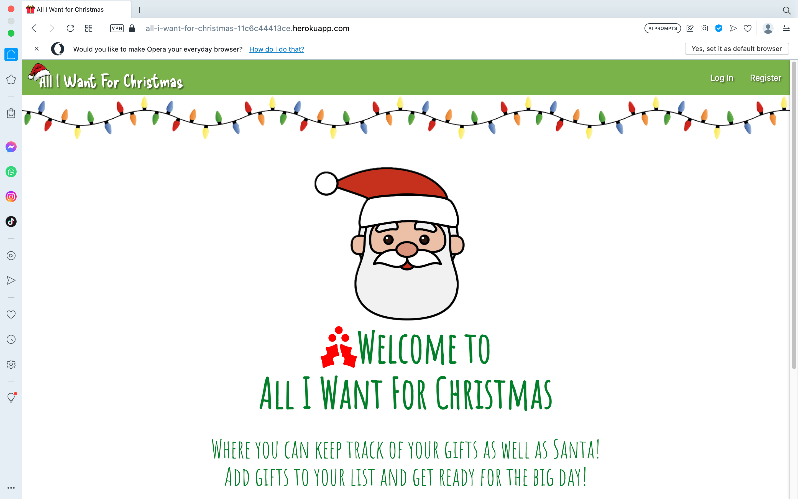
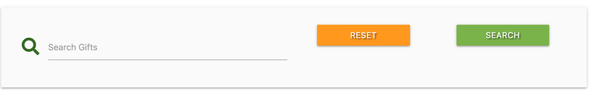
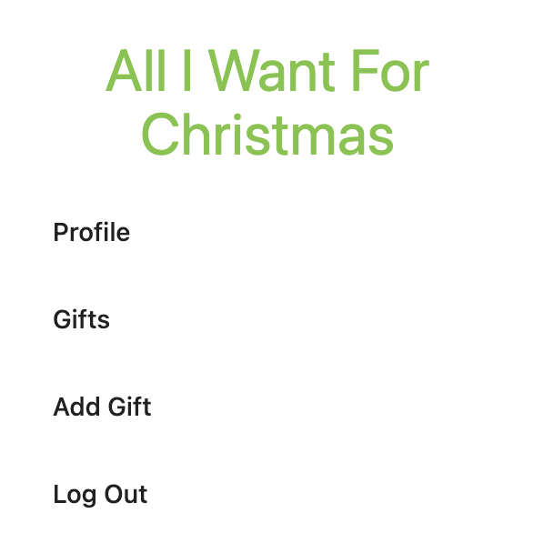

# Testing

Return back to the [README.md](README.md) file.

The site has been tested manually and using validators/linters to ensure that it is working properly.

## Code Validation

### HTML

I have used the recommended [HTML W3C Validator](https://validator.w3.org) to validate all of my HTML files.

| Page | W3C URL | Screenshot | Notes |
| --- | --- | --- | --- |
| Welcome | [W3C](https://validator.w3.org/nu/?doc=https%3A%2F%2Fall-i-want-for-christmas-11c6c44413ce.herokuapp.com%2F) |  | Section lacks header h2-h6 warning |
| Register Page | [W3C](https://validator.w3.org/nu/?doc=https%3A%2F%2Fall-i-want-for-christmas-11c6c44413ce.herokuapp.com%2Fregister) |  | Section lacks header h2-h6 warning |
| Profile Login Page | [W3C](https://validator.w3.org/nu/?doc=https%3A%2F%2Fall-i-want-for-christmas-11c6c44413ce.herokuapp.com%2Fprofile_login) |  | Section lacks header h2-h6 warning |
| Profile Page | n/a |  | Section lacks header h2-h6 warning |
| All Gifts - List Page | n/a |  | Section lacks header h2-h6 warning |
| Add Gift Page | [W3C](https://validator.w3.org/nu/?doc=https%3A%2F%2Fall-i-want-for-christmas-11c6c44413ce.herokuapp.com%2Fadd_gift) |  | Section lacks header h2-h6 warning |
| Edit Gift Page | n/a |  | Section lacks header h2-h6 warning |

### CSS

I have used the recommended [CSS Jigsaw Validator](https://jigsaw.w3.org/css-validator) to validate all of my CSS files. I have used the live deployed site in the validator.

| File | Jigsaw URL | Screenshot | Notes |
| --- | --- | --- | --- |
| style.css | [Jigsaw](https://jigsaw.w3.org/css-validator/validator?uri=https%3A%2F%2FD3lyth.github.io%2Fall-i-want-for-christmas) |  | Pass: No Errors (Error due to external library only) |

### JavaScript

I have used the recommended [JShint Validator](https://jshint.com) to validate both my JS files.

| File | Screenshot | Notes |
| --- | --- | --- |
| script.js |  | Unused variables from external files (Materialize)|
| countdown.js |  | Pass: No Errors |

### Python

I have used the recommended [PEP8 CI Python Linter](https://pep8ci.herokuapp.com) to validate all of my Python files.

| File | CI URL | Screenshot | Notes |
| --- | --- | --- | --- |
| app.py | [PEP8 CI](https://pep8ci.herokuapp.com/https://raw.githubusercontent.com/D3lyth/all-i-want-for-christmas/main/app.py) |  | No Errors |
| countdown.py | [PEP8 CI](https://pep8ci.herokuapp.com/https://raw.githubusercontent.com/D3lyth/all-i-want-for-christmas/main/countdown.py) |  | No Errors |

## Browser Compatibility

I've tested my deployed project on multiple browsers to check for compatibility issues.

| Browser | Screenshot | Notes |
| --- | --- | --- |
| Chrome |  | Works as expected |
| Firefox |  | Works as expected |
| Safari |  | Works as expected |
| Brave |  | Works as expected |
| Opera |  | Works as expected |

## Responsiveness

I've tested my deployed project on multiple devices to check for responsiveness issues.

| Device | Screenshot | Notes |
| --- | --- | --- |
| Mobile (DevTools) |  | Works as expected |
| Tablet (DevTools) |  | Works as expected |
| Desktop |  | Works as expected |
| XL Monitor |  | Scaling starts to have minor issues |
| 4K Monitor |  | Noticeable scaling issues |
| iPad Air |  | Works as expected ||
| iPhone 14 |  | Works as expected |

## Lighthouse Audit

I've tested my deployed project using the Lighthouse Audit tool to check for any major issues.

| Page | Size | Screenshot | Notes |
| --- | --- | --- | --- |
| Welcome | Mobile |  | Some minor warnings |
| Welcome | Desktop |  | Few warnings |
| Register | Mobile |  | Some minor warnings |
| Register | Desktop |  | Few warnings |
| Profile Login | Mobile |  | Slow response time due to large images |
| Profile Login | Desktop |  | Slow response time due to large images |
| Profile | Mobile |  | Slow response time due to large images |
| Profile | Desktop |  | Slow response time due to large images |
| Gift List Page | Mobile |  | Slow response time due to large images |
| Gift List Page| Desktop |  | Slow response time due to large images |
| Edit Gift | Mobile |  | Slow response time due to large images |
| Edit Gift | Desktop |  | Slow response time due to large images |
| Add Gift | Mobile |  | Slow response time due to large images |
| Add Gift | Desktop |  | Slow response time due to large images |

## Defensive Programming

Defensive programming was manually tested with the below user acceptance testing:

| Page | User Action | Expected Result | Pass/Fail | Comments |
| --- | --- | --- | --- | --- |
| Welcome Page | | | | |
| | Click on Logo | Redirection to Home page | Pass | |
| | Click on Profile link in navbar | Redirection to Profile page | Pass | |
| | Click on Profile link in sidebar | Redirection to Profile page | Pass | |
| | Click on Register link in navbar | Redirection to Register page | Pass | |
| | Click on Register link in sidebar | Redirection to Register page | Pass | |
| | Click on Gifts link in navbar | Redirection to Gifts page | Pass | |
| | Click on Gifts link in sidebar | Redirection to Gifts page | Pass | |
| | Click on Add Gift link in navbar | Redirection to Add Gift page | Pass | |
| | Click on Add Gift link in sidebar | Redirection to Add Gift page | Pass | |
| | Click on Register button | Redirection to Register page | Pass | |
| | Enter username on register form | Field will accept freeform text | Pass | |
| | Enter valid password | Field will only accept password format | Pass | Registration successful flash massage shown for successful new profile |
| Log In | | | | |
| | Click on the Login link | Redirection to Login page | Pass | |
| | Enter username on login page | Field will accept freeform text | Pass | |
| | Enter valid password on login page | Field will only accept password of with a certain format/length | Pass | User you are logged in message if successfully logged in |
| Log Out | | | | |
| | Click Logout button | Redirects user to logout page | Pass | Flash message will confirm log out |
| Profile | | | | |
| | Click on Profile button | User will be redirected to the Profile page | Pass | |
| Add Gift | | | | |
| | Click on the Edit button | User will be redirected to the edit gift page | Pass | |
| | Click on the Delete button | User will be redirected to the gift page | Pass | Modal message will appear to confirm deletion of gift |
| | Click on the Got It! button | User will be redirected to the gift page | Pass | |
| All Gifs / Profile Page | | | | |
| | Click on the Undo button | User will be redirected to the Profile page | Pass | Modal message will appear to confirm if user wants to undo action|
| | Click on the Delete button | User will be redirected to the gift page | Pass | Modal message will appear to confirm deletion of gift |
| | Click on the Got It! button | User will be redirected to the gift page | Pass | |
| | Brute forcing the URL to get to another user's profile | User should be given an error | Pass | Redirects user back to own profile or login page |

## User Story Testing

| User Story | Screenshot |
| --- | --- |
| As a new site user, I would like to ____________, so that I can ____________. |  |
| As a new site user, I would like to ____________, so that I can ____________. |  |
| As a new site user, I would like to ____________, so that I can ____________. |  |
| As a returning site user, I would like to ____________, so that I can ____________. |  |
| As a returning site user, I would like to ____________, so that I can ____________. |  |
| As a returning site user, I would like to ____________, so that I can ____________. |  |
| As a site administrator, I should be able to ____________, so that I can ____________. |  |
| As a site administrator, I should be able to ____________, so that I can ____________. |  |
| As a site administrator, I should be able to ____________, so that I can ____________. |  |

| As a returning site user, I would like to ____________, so that I can ____________. |  |
| As a returning site user, I would like to ____________, so that I can ____________. |  |
| As a returning site user, I would like to ____________, so that I can ____________. |  |
| As a returning site user, I would like to ____________, so that I can ____________. |  |
| As a returning site user, I would like to ____________, so that I can ____________. |  |
| As a returning site user, I would like to ____________, so that I can ____________. |  |
| As a returning site user, I would like to ____________, so that I can ____________. |  |
| As a returning site user, I would like to ____________, so that I can ____________. |  |
| As a returning site user, I would like to ____________, so that I can ____________. |  |
| As a returning site user, I would like to ____________, so that I can ____________. |  |
| As a returning site user, I would like to ____________, so that I can ____________. |  |

## Automated Testing

I have conducted a series of automated tests on my application.

I fully acknowledge and understand that, in a real-world scenario, an extensive set of additional tests would be more comprehensive.

### Python (Unit Testing)

⚠️⚠️⚠️⚠️⚠️ START OF NOTES (to be deleted) ⚠️⚠️⚠️⚠️⚠️

Adjust the code below (file names, etc.) to match your own project files/folders.

🛑🛑🛑🛑🛑 END OF NOTES (to be deleted) 🛑🛑🛑🛑🛑

I have used Python's built-in unit testing framework to test the application functionality.

In order to run the tests, I ran the following command in the terminal each time:

`python3 manage.py test name-of-app`

To create the coverage report, I would then run the following commands:

`coverage run --source=name-of-app manage.py test`

`coverage report`

To see the HTML version of the reports, and find out whether some pieces of code were missing, I ran the following commands:

`coverage html`

`python3 -m http.server`

Below are the results from the various apps on my application that I've tested:

| App | File | Coverage | Screenshot |
| --- | --- | --- | --- |
| Bag | test_forms.py | 99% |  |
| Bag | test_models.py | 89% |  |
| Bag | test_urls.py | 100% |  |
| Bag | test_views.py | 71% |  |
| Checkout | test_forms.py | 99% |  |
| Checkout | test_models.py | 89% |  |
| Checkout | test_urls.py | 100% |  |
| Checkout | test_views.py | 71% |  |
| Home | test_forms.py | 99% |  |
| Home | test_models.py | 89% |  |
| Home | test_urls.py | 100% |  |
| Home | test_views.py | 71% |  |
| Products | test_forms.py | 99% |  |
| Products | test_models.py | 89% |  |
| Products | test_urls.py | 100% |  |
| Products | test_views.py | 71% |  |
| Profiles | test_forms.py | 99% |  |
| Profiles | test_models.py | 89% |  |
| Profiles | test_urls.py | 100% |  |
| Profiles | test_views.py | 71% |  |
| x | x | x | repeat for all remaining tested apps/files |

#### Unit Test Issues

⚠️⚠️⚠️⚠️⚠️ START OF NOTES (to be deleted) ⚠️⚠️⚠️⚠️⚠️

Use this section to list any known issues you ran into while writing your unit tests.
Remember to include screenshots (where possible), and a solution to the issue (if known).

This can be used for both "fixed" and "unresolved" issues.

🛑🛑🛑🛑🛑 END OF NOTES (to be deleted) 🛑🛑🛑🛑🛑

## Bugs

⚠️⚠️⚠️⚠️⚠️ START OF NOTES (to be deleted) ⚠️⚠️⚠️⚠️⚠️

It's very important to document any bugs you've discovered while developing the project.
Make sure to include any necessary steps you've implemented to fix the bug(s) as well.

For JavaScript and Python applications, it's best to screenshot the errors to include them as well.

**PRO TIP**: screenshots of bugs are extremely helpful, and go a long way!

🛑🛑🛑🛑🛑 END OF NOTES (to be deleted) 🛑🛑🛑🛑🛑

- JS Uncaught ReferenceError: `foobar` is undefined/not defined

    

  - To fix this, I _____________________.

- JS `'let'` or `'const'` or `'template literal syntax'` or `'arrow function syntax (=>)'` is available in ES6 (use `'esversion: 11'`) or Mozilla JS extensions (use moz).

    

  - To fix this, I _____________________.

- Python `'ModuleNotFoundError'` when trying to import module from imported package

    

  - To fix this, I _____________________.

- Django `TemplateDoesNotExist` at /appname/path appname/template_name.html

    

  - To fix this, I _____________________.

- Python `E501 line too long` (93 > 79 characters)

    

  - To fix this, I _____________________.

### GitHub **Issues**

⚠️⚠️⚠️⚠️⚠️ START OF NOTES (to be deleted) ⚠️⚠️⚠️⚠️⚠️

An improved way to manage bugs is to use the built-in **Issues** tracker on your GitHub repository.
To access your Issues, click on the "Issues" tab at the top of your repository.
Alternatively, use this link: <https://github.com/D3lyth/all-i-want-for-christmas/issues>

If using the Issues tracker for your bug management, you can simplify the documentation process.
Issues allow you to directly paste screenshots into the issue without having to first save the screenshot locally,
then uploading into your project.

You can add labels to your issues (`bug`), assign yourself as the owner, and add comments/updates as you progress with fixing the issue(s).

Once you've sorted the issue, you should then "Close" it.

When showcasing your bug tracking for assessment, you can use the following format:

🛑🛑🛑🛑🛑 END OF NOTES (to be deleted) 🛑🛑🛑🛑🛑

**Fixed Bugs**

All previously closed/fixed bugs can be tracked [here](https://github.com/D3lyth/all-i-want-for-christmas/issues?q=is%3Aissue+is%3Aclosed).

| Bug | Status |
| --- | --- |
| [JS Uncaught ReferenceError: `foobar` is undefined/not defined](https://github.com/D3lyth/all-i-want-for-christmas/issues/1) | Closed |
| [Python `'ModuleNotFoundError'` when trying to import module from imported package](https://github.com/D3lyth/all-i-want-for-christmas/issues/2) | Closed |
| [Django `TemplateDoesNotExist` at /appname/path appname/template_name.html](https://github.com/D3lyth/all-i-want-for-christmas/issues/3) | Closed |

**Open Issues**

Any remaining open issues can be tracked [here](https://github.com/D3lyth/all-i-want-for-christmas/issues).

| Bug | Status |
| --- | --- |
| [JS `'let'` or `'const'` or `'template literal syntax'` or `'arrow function syntax (=>)'` is available in ES6 (use `'esversion: 11'`) or Mozilla JS extensions (use moz).](https://github.com/D3lyth/all-i-want-for-christmas/issues/4) | Open |
| [Python `E501 line too long` (93 > 79 characters)](https://github.com/D3lyth/all-i-want-for-christmas/issues/5) | Open |

## Unfixed Bugs

⚠️⚠️⚠️⚠️⚠️ START OF NOTES (to be deleted) ⚠️⚠️⚠️⚠️⚠️

You will need to mention unfixed bugs and why they were not fixed.
This section should include shortcomings of the frameworks or technologies used.
Although time can be a big variable to consider, paucity of time and difficulty understanding
implementation is not a valid reason to leave bugs unfixed.

If you've identified any unfixed bugs, no matter how small, be sure to list them here.
It's better to be honest and list them, because if it's not documented and an assessor finds the issue,
they need to know whether or not you're aware of them as well, and why you've not corrected/fixed them.

Some examples:

🛑🛑🛑🛑🛑 END OF NOTES (to be deleted) 🛑🛑🛑🛑🛑

- On devices smaller than 375px, the page starts to have `overflow-x` scrolling.

    

  - Attempted fix: I tried to add additional media queries to handle this, but things started becoming too small to read.

- For PP3, when using a helper `clear()` function, any text above the height of the terminal does not clear, and remains when you scroll up.

    

  - Attempted fix: I tried to adjust the terminal size, but it only resizes the actual terminal, not the allowable area for text.

- When validating HTML with a semantic `section` element, the validator warns about lacking a header `h2-h6`. This is acceptable.

    

  - Attempted fix: this is a known warning and acceptable, and my section doesn't require a header since it's dynamically added via JS.

⚠️⚠️⚠️⚠️⚠️ START OF NOTES (to be deleted) ⚠️⚠️⚠️⚠️⚠️

If you legitimately cannot find any unfixed bugs or warnings, then use the following sentence:

🛑🛑🛑🛑🛑 END OF NOTES (to be deleted) 🛑🛑🛑🛑🛑

There are no remaining bugs that I am aware of.
