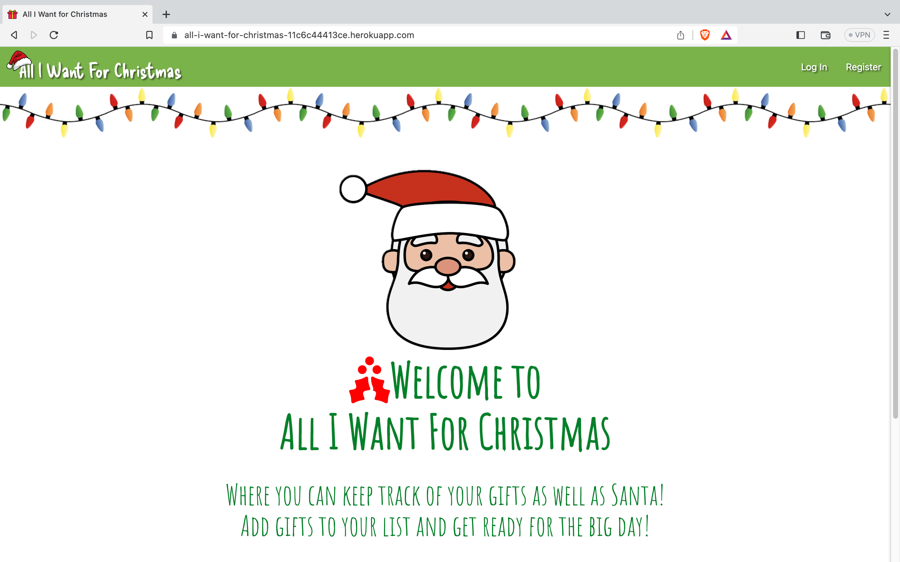
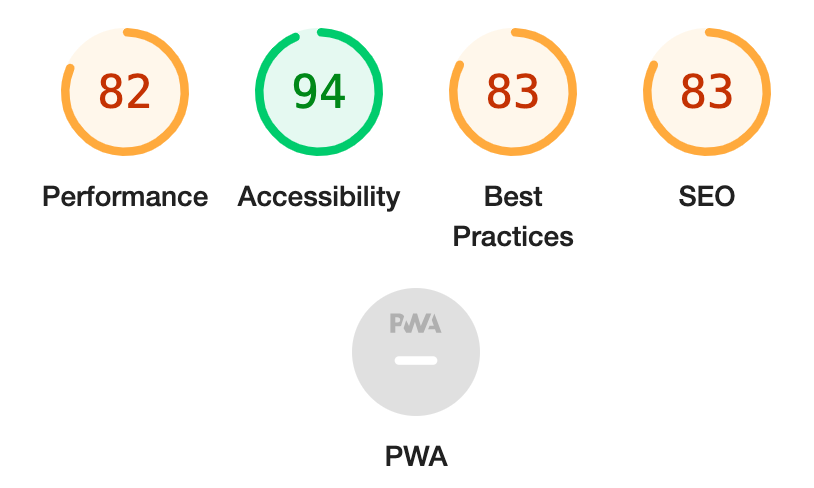
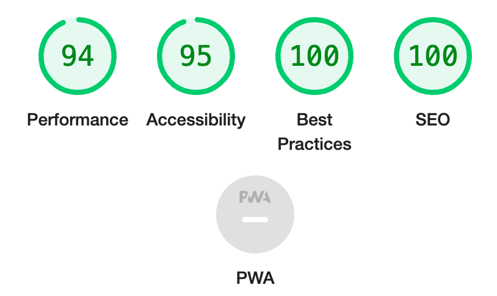

# Testing

Return back to the [README.md](README.md) file.

The site has been tested manually and using validators/linters to ensure that it is working properly.

## Code Validation

### HTML

I have used the recommended [HTML W3C Validator](https://validator.w3.org) to validate all of my HTML files.

| Page | W3C URL | Screenshot | Notes |
| --- | --- | --- | --- |
| Welcome | [W3C](https://validator.w3.org/nu/?doc=https%3A%2F%2Fall-i-want-for-christmas-11c6c44413ce.herokuapp.com%2F) |  | Section lacks header h2-h6 warning |
| Register Page | [W3C](https://validator.w3.org/nu/?doc=https%3A%2F%2Fall-i-want-for-christmas-11c6c44413ce.herokuapp.com%2Fregister) |  | Section lacks header h2-h6 warning |
| Profile Login Page | [W3C](https://validator.w3.org/nu/?doc=https%3A%2F%2Fall-i-want-for-christmas-11c6c44413ce.herokuapp.com%2Fprofile_login) |  | Section lacks header h2-h6 warning |
| Profile Page | n/a |  | Section lacks header h2-h6 warning |
| All Gifts - List Page | n/a |  | Section lacks header h2-h6 warning |
| Add Gift Page | [W3C](https://validator.w3.org/nu/?doc=https%3A%2F%2Fall-i-want-for-christmas-11c6c44413ce.herokuapp.com%2Fadd_gift) |  | Section lacks header h2-h6 warning |
| Edit Gift Page | n/a |  | Section lacks header h2-h6 warning |

### CSS

I have used the recommended [CSS Jigsaw Validator](https://jigsaw.w3.org/css-validator) to validate all of my CSS files. I have used the live deployed site in the validator.

| File | Jigsaw URL | Screenshot | Notes |
| --- | --- | --- | --- |
| style.css | [Jigsaw](https://jigsaw.w3.org/css-validator/validator?uri=https%3A%2F%2FD3lyth.github.io%2Fall-i-want-for-christmas) |  | Pass: No Errors (Error due to external library only) |

### JavaScript

I have used the recommended [JShint Validator](https://jshint.com) to validate both my JS files.

| File | Screenshot | Notes |
| --- | --- | --- |
| script.js |  | Unused variables from external files (Materialize)|
| countdown.js |  | Pass: No Errors |

### Python

I have used the recommended [PEP8 CI Python Linter](https://pep8ci.herokuapp.com) to validate all of my Python files.

| File | CI URL | Screenshot | Notes |
| --- | --- | --- | --- |
| app.py | [PEP8 CI](https://pep8ci.herokuapp.com/https://raw.githubusercontent.com/D3lyth/all-i-want-for-christmas/main/app.py) |  | No Errors |
| countdown.py | [PEP8 CI](https://pep8ci.herokuapp.com/https://raw.githubusercontent.com/D3lyth/all-i-want-for-christmas/main/countdown.py) |  | No Errors |

## Browser Compatibility

I've tested my deployed project on multiple browsers to check for compatibility issues.

| Browser | Screenshot | Notes |
| --- | --- | --- |
| Chrome |  | Works as expected |
| Firefox |  | Works as expected |
| Safari |  | Works as expected |
| Brave |  | Works as expected |
| Opera |  | Works as expected |

## Responsiveness

I've tested my deployed project on multiple devices to check for responsiveness issues.

| Device | Screenshot | Notes |
| --- | --- | --- |
| Mobile (DevTools) |  | Works as expected |
| Tablet (DevTools) |  | Works as expected |
| Desktop |  | Works as expected |
| XL Monitor |  | Scaling starts to have minor issues |
| 4K Monitor |  | Noticeable scaling issues |
| iPad Air |  | Works as expected ||
| iPhone 14 |  | Works as expected |

## Lighthouse Audit

I've tested my deployed project using the Lighthouse Audit tool to check for any major issues.

| Page | Size | Screenshot | Notes |
| --- | --- | --- | --- |
| Welcome | Mobile |  | Some minor warnings |
| Welcome | Desktop |  | Few warnings |
| Register | Mobile |  | Some minor warnings |
| Register | Desktop |  | Few warnings |
| Profile Login | Mobile |  | Slow response time due to large images |
| Profile Login | Desktop |  | Slow response time due to large images |
| Profile | Mobile |  | Slow response time due to large images |
| Profile | Desktop |  | Slow response time due to large images |
| Gift List Page | Mobile |  | Slow response time due to large images |
| Gift List Page| Desktop |  | Slow response time due to large images |
| Edit Gift | Mobile |  | Slow response time due to large images |
| Edit Gift | Desktop |  | Slow response time due to large images |
| Add Gift | Mobile |  | Slow response time due to large images |
| Add Gift | Desktop |  | Slow response time due to large images |

## Defensive Programming

Defensive programming was manually tested with the below user acceptance testing:

| Page | User Action | Expected Result | Pass/Fail | Comments |
| --- | --- | --- | --- | --- |
| Welcome Page | | | | |
| | Click on Logo | Redirection to Home page | Pass | |
| | Click on Profile link in navbar | Redirection to Profile page | Pass | |
| | Click on Profile link in sidebar | Redirection to Profile page | Pass | |
| | Click on Register link in navbar | Redirection to Register page | Pass | |
| | Click on Register link in sidebar | Redirection to Register page | Pass | |
| | Click on Gifts link in navbar | Redirection to Gifts page | Pass | |
| | Click on Gifts link in sidebar | Redirection to Gifts page | Pass | |
| | Click on Add Gift link in navbar | Redirection to Add Gift page | Pass | |
| | Click on Add Gift link in sidebar | Redirection to Add Gift page | Pass | |
| | Click on Register button | Redirection to Register page | Pass | |
| | Enter username on register form | Field will accept freeform text | Pass | |
| | Enter valid password | Field will only accept password format | Pass | Registration successful flash massage shown for successful new profile |
| Log In | | | | |
| | Click on the Login link | Redirection to Login page | Pass | |
| | Enter username on login page | Field will accept freeform text | Pass | |
| | Enter valid password on login page | Field will only accept password of with a certain format/length | Pass | User you are logged in message if successfully logged in |
| Log Out | | | | |
| | Click Logout button | Redirects user to logout page | Pass | Flash message will confirm log out |
| Profile | | | | |
| | Click on Profile button | User will be redirected to the Profile page | Pass | |
| Add Gift | | | | |
| | Click on the Edit button | User will be redirected to the edit gift page | Pass | |
| | Click on the Delete button | User will be redirected to the gift page | Pass | Modal message will appear to confirm deletion of gift |
| | Click on the Got It! button | User will be redirected to the gift page | Pass | |
| All Gifs / Profile Page | | | | |
| | Click on the Undo button | User will be redirected to the Profile page | Pass | Modal message will appear to confirm if user wants to undo action|
| | Click on the Delete button | User will be redirected to the gift page | Pass | Modal message will appear to confirm deletion of gift |
| | Click on the Got It! button | User will be redirected to the gift page | Pass | |
| | Brute forcing the URL to get to another user's profile | User should be given an error | Pass | Redirects user back to own profile or login page |

## User Story Testing

| User Story | Screenshot |
| --- | --- |
| As a new site user and returning user, I would like to click on the logo, so that I can return to the welcome page. |  |
| As a returning user, I would like to fill in a log in form, so that I can get to my gift list to be able to delete/edit/add to it. |  |
| As a new site user, I would like to register for an account, so that I can begin using the app and create gift lists. |  |
| As a new site user and returning user, I would like to click on a button to begin adding items, so that I can create and add gifts to the list in an efficient manner. |  |
| As a new site user and returning user, I would like to have access and see a christmas countdown timer, so that I can keep track of how many shopping days i have left. |  |
| As a new site user and returning user, I would like to search for specific items on my list, so that I can check who I need to buy for, and also filter by shop if I'm at a specific store. |  |
| As a new site user and returning user, I should be able to click on the delete button, so that I can get rid of gifts that I no longer need to buy. |  |
| As a new site user and returning user, I would like to click on the Got it! button, so that I can move items from my to buy list but still keep a record of the gifts I've already bought. |  |
| As a new site user and returning user, I would like to be able to click a button and edit a git, so that I can change the information incase of a mistake or a change in price/shop. |  |
| As a new site user and returning user, I would like to be able to navigate around the site efficiently, so that I can make use of teh gift list functionallity when in a rush. |  |
| As a new site user and returning user, I would like to be able to keep track of all the fifts bought in a central place, so that I can monitor how much I have spent and who I've bought gfts for. |  |

## Bugs

- JS Uncaught ReferenceError: `foobar` is undefined/not defined
  - To fix this, I debugged to make sure that the script was loading correctly.

- Python `E501 line too long` (93 > 79 characters)
  - To fix this, I refactored the code toand placed breaks to make sure that it was PEP8 compliant for teh Python linter.

- Styling and CSS issues
  - Some of the imges used were not placed correctly on the page. To fix this I changed my css to use units that were more responsive (`vh` instead of `px`) and set the `body` to `min-height:100vh` to ensure that the footer stayed at the bottom of the page.

- Countdown timer display
  - The countdown timer was set up using `<divs>` that made the html less semantic and more difficult to style. I fixed this my changing the `
` to a ``, which rectified the issue.

### Open Issues

Any remaining open issues can be tracked [here](https://github.com/D3lyth/all-i-want-for-christmas/issues).

| Bug | Status |
| --- | --- |
| [JS `'let'` or `'const'` or `'template literal syntax'` or `'arrow function syntax (=>)'` is available in ES6 (use `'esversion: 11'`) or Mozilla JS extensions (use moz).](https://github.com/D3lyth/all-i-want-for-christmas/issues/4) | Open |
| [Python `E501 line too long` (93 > 79 characters)](https://github.com/D3lyth/all-i-want-for-christmas/issues/5) | Open |

## Unfixed Bugs

⚠️⚠️⚠️⚠️⚠️ START OF NOTES (to be deleted) ⚠️⚠️⚠️⚠️⚠️

You will need to mention unfixed bugs and why they were not fixed.
This section should include shortcomings of the frameworks or technologies used.
Although time can be a big variable to consider, paucity of time and difficulty understanding
implementation is not a valid reason to leave bugs unfixed.

If you've identified any unfixed bugs, no matter how small, be sure to list them here.
It's better to be honest and list them, because if it's not documented and an assessor finds the issue,
they need to know whether or not you're aware of them as well, and why you've not corrected/fixed them.

- On devices smaller than 375px, the page starts to have `overflow-x` scrolling.

    

  - Attempted fix: I tried to add additional media queries to handle this, but things started becoming too small to read.

- When validating HTML with a semantic `section` element, the validator warns about lacking a header `h2-h6`. This is acceptable.

    

  - Attempted fix: this is a known warning and acceptable, and my section doesn't require a header since it's dynamically added via JS.

- When validating the JS using a linter, the validator warns about unidentified variables, M. This variable is due to the use of Materialize and with it being an external library is is acceptable.

Other than the bugs mentioned above, there are no remaining bugs that I am aware of.
